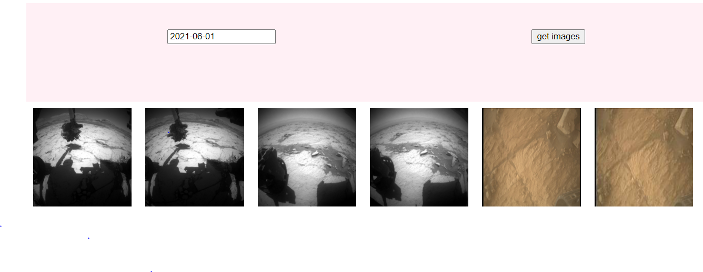

# MARS_IMAGES_DATE_WISE_API
It is a website which require you to enter the date ( date previous than current dates) and it will fetch the images of the mars on that particular date. If no images found it will display not found message. So you can choose any other date and see the Mars images provided by NASA. 

## INSTRUCTIONS TO USE
- Enter the date (must be a past date)
- click "get images" button
- if NASA uploaded pictures on that date you can see the images
- else not found will be displayed

## Project images

